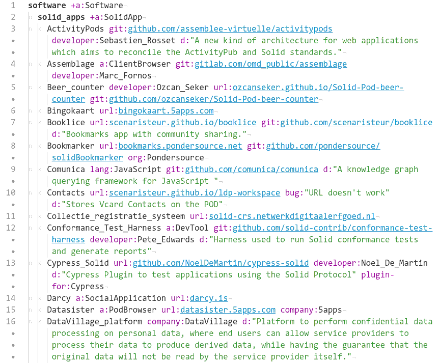

## Setup

* First, to pull neccessary Clojure libraries, install [*My-solid-agent*](https://codeberg.org/prozion/my-solid-agent)
* Then add `export TABTREE_LIB=~/.gitlibs/_repos/https/codeberg.org/prozion/clj-tabtree` to your `~/.bashrc`
* `$ source ~/.bashrc`
* Install SHACL validator
  * Download [zip archive](https://www.itb.ec.europa.eu/shacl-offline/any/validator.zip)
  <!-- * Unzip archive and place it on the CLASSPATH (e.g. in your `~/.bashrc`: `export CLASSPATH=$CLASSPATH:~/bin/shacla-validator`) -->

## Setup Tabtree editor

For better experience with editing Tabtree format files, install [Tabtree syntax plugin](https://github.com/prozion/tabtree-atom-syntax) in [Pulsar code editor](https://pulsar-edit.dev/).

## Usage

### Edit Tabtree source files
Add or edit data in `source/*.tree` files

That's how Tabtree looks with syntax highlighting in Pulsar:

### Build RDF
Launch compile script: `$ ./build.sh`

- First it finds undeclared classes, properties and individuals baing used as objects or predicates in the triples.
- Then it validates resulting RDF
- And checks this RDF against SHACL shapes

If all checks passed successfully, you can copy resulting RDF (target/*) to your POD (a convenient option for it is [PodPro app](https://podpro.dev/))
